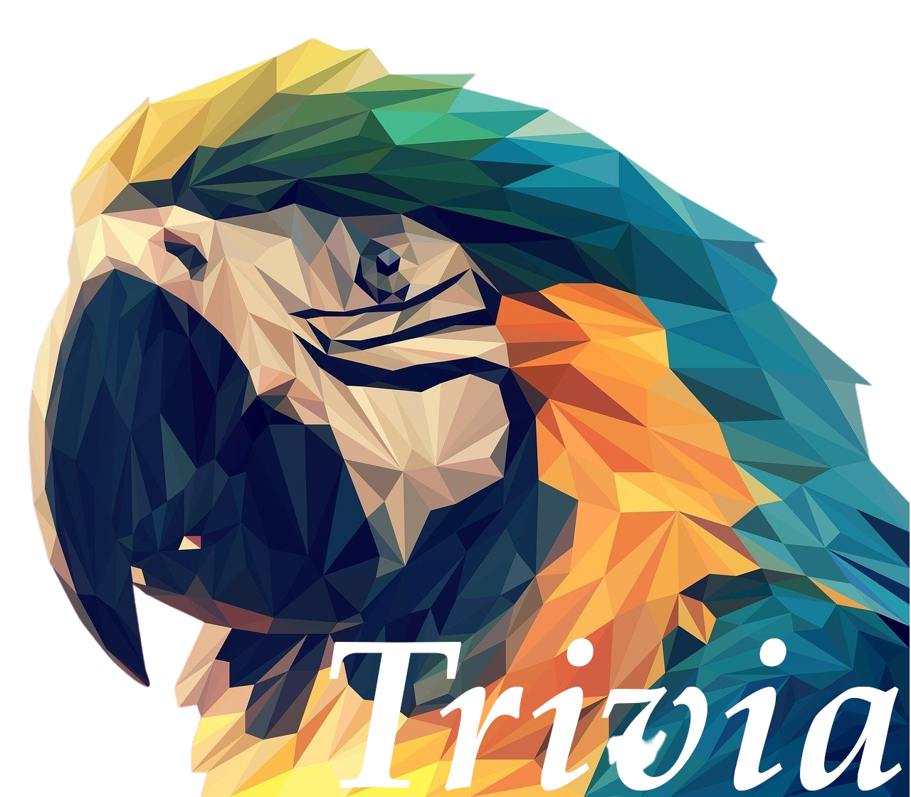
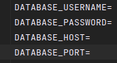

# Trivia Game


This project is a trivia game about colombia in which it has categories such as nature, history, sports and colombian laws.
## Installation
### Clone the repository
```shell
git@github.com:CristianDavidVB/Trivia.git

cd Trivia
```
### Check your Ruby version
```shell
ruby -v
```
The ouput should start with something like ruby 3.2.2

If not, install the right ruby version using [rbenv](https://github.com/rbenv/rbenv) (it could take a while):

```shell
rbenv install 3.2.2
```

### Install dependencies
Using Bundler:
```shell
bundle install
```
### Set environment variables
Using dotenv:

an .env file is created in the project's main folder

The following is added to the .env file so that it works together with the ENV we have in config/database.yml



### Docker

[docker](https://www.docker.com/) you must modify the words between " "
```shell
docker run -- "here is the container name" -e POSTGRES_USER="YOUR USER" -e POSTGRES_PASSWORD="YOUR PASSWORD" -p 5432"other number":5432 -d postgres:14
```
### Initialize the database
```shell
rails db:create db:migrate db:seed
```


